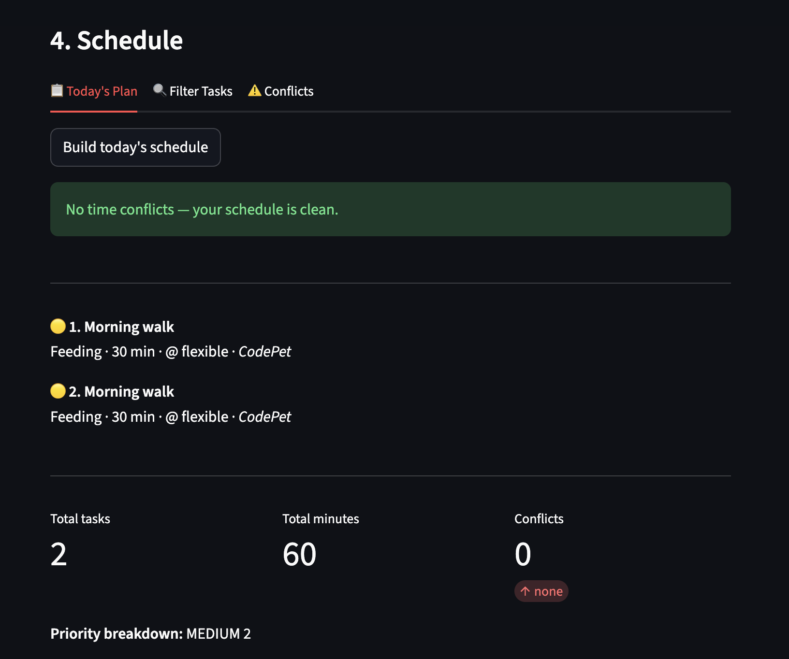

# PawPal+ (Module 2 Project)

**PawPal+** is a Streamlit app that helps a pet owner plan daily care tasks for one or more pets. It uses a Python OOP backend to sort, filter, and schedule tasks intelligently, detecting time conflicts and automatically renewing recurring tasks.

## Scenario

A busy pet owner needs help staying consistent with pet care. They want an assistant that can:

- Track pet care tasks (walks, feeding, meds, enrichment, grooming, etc.)
- Consider constraints (time available, priority, owner preferences)
- Produce a daily plan and explain why it chose that plan

## Features

| Feature | Description |
|---|---|
| **Owner & pet profiles** | Create an owner with preferences (walk time, max daily hours) and add multiple pets with species, breed, and age. |
| **Task management** | Add tasks with a type (walk, feeding, medication, appointment, other), priority (low/medium/high), optional fixed start time, duration, and notes. |
| **Time-based sorting** | `Scheduler.sort_by_time()` orders all pending tasks chronologically — fixed-time tasks first (ascending), then flexible tasks by priority score descending. |
| **Flexible filtering** | `Scheduler.filter_tasks(pet_name, completed)` filters the task pool by pet and/or completion status. Both arguments are optional and composable. |
| **Recurring task renewal** | `Scheduler.complete_task(task)` marks a task done and, if `is_recurring=True`, uses `Task.renew()` to create a fresh pending copy on the same pet. Completed originals are preserved for history. |
| **Conflict detection** | `Scheduler.conflict_warnings()` compares time windows (start + duration) for all pending fixed-time tasks and returns human-readable warnings for every overlap — never crashes, never auto-reschedules. |
| **Daily summary** | `Scheduler.daily_summary()` returns total tasks, total minutes, priority breakdown, and conflict pairs in a single dict used by both the CLI demo and the UI. |

## 📸 Demo

<a href="demo_pic/demo_schedule.png" target="_blank"></a>

## Project structure

```
pawpal_system.py   # backend: Owner, Pet, Task, Scheduler classes
app.py             # Streamlit UI — imports from pawpal_system
main.py            # CLI demo script (run to see all features in the terminal)
tests/
  test_pawpal.py   # 33 pytest tests
requirements.txt
```

## Smarter Scheduling

PawPal+ sorts tasks using Python's `sorted()` with a `lambda` key on `datetime.time` objects:

```python
fixed = sorted(
    [t for t in all_tasks if t.is_fixed_time()],
    key=lambda t: t.scheduled_time,
)
```

Conflict detection compares minute offsets:

```python
a_start = a.scheduled_time.hour * 60 + a.scheduled_time.minute
a_end   = a_start + a.duration_minutes
# overlap when one starts before the other ends
if a_start < b_end and b_start < a_end:
    conflicts.append((a, b))
```

## Testing PawPal+

Run the full test suite with:

```bash
python -m pytest
```

The suite lives in `tests/test_pawpal.py` and covers **33 tests** across all four classes:

| Area | What's tested |
|---|---|
| `Task` | Completion flag, priority score ordering, `is_fixed_time`, `summary` output, `renew` immutability |
| `Pet` | Task stamping, count changes, priority sort order, `remove_task` happy/not-found paths, empty-pet edge case |
| `Owner` | Task flattening across pets, `get_pet` miss, `remove_pet` |
| `Scheduler` | Conflict detection (overlap, same-time, no-overlap), empty schedule, completed-task exclusion, `sort_by_time` ordering, `filter_tasks` by pet/status, recurring renewal, `conflict_warnings` format |

**Confidence level: ★★★★☆**
All happy paths and the main edge cases (no tasks, identical start times, non-recurring tasks, renewal immutability) are covered. Areas not yet tested: owner preferences affecting schedule order, multi-day recurrence windows, and UI-layer state management.

## Getting started

### Setup

```bash
python -m venv .venv
source .venv/bin/activate  # Windows: .venv\Scripts\activate
pip install -r requirements.txt
```

### Run the Streamlit app

```bash
streamlit run app.py
```

### Run the CLI demo

```bash
python main.py
```

### Run tests

```bash
python -m pytest
```

## System architecture (UML)

See the final Mermaid.js class diagram in [reflection.md](reflection.md) under Section 1a.
