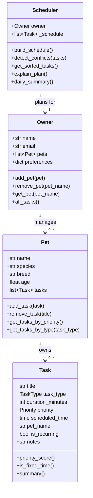

# PawPal+ Project Reflection

## 1. System Design

**a. Initial design**

- Briefly describe your initial UML design.
- What classes did you include, and what responsibilities did you assign to each?

Three core user actions I identified:
1. Add a pet and assign daily care tasks to it.
2. Schedule a day — generate a prioritized, conflict-free plan of tasks.
3. View today's schedule with an explanation of why each task is placed when it is.

Classes and their responsibilities:

| Class | Responsibilities |
|---|---|
| `Task` | Holds all data about a single care action (title, type, duration, priority, optional fixed start time). Knows how to compute its own priority score and produce a one-line summary. |
| `Pet` | Owns a list of Tasks. Provides helpers to filter/sort tasks by priority or type. Stamps each added task with the pet's name. |
| `Owner` | Manages a list of Pets and stores preferences (e.g. preferred walk time). Aggregates all tasks across pets for the scheduler. |
| `Scheduler` | Takes an Owner, collects all tasks, sorts them (fixed-time tasks first, then by priority), detects overlapping time windows, and produces an annotated daily plan with explanations. |

UML diagram (Mermaid.js):

**b. Design changes**

- Did your design change during implementation?
- If yes, describe at least one change and why you made it.

---

## 2. Scheduling Logic and Tradeoffs

**a. Constraints and priorities**

- What constraints does your scheduler consider (for example: time, priority, preferences)?
- How did you decide which constraints mattered most?

**b. Tradeoffs**

- Describe one tradeoff your scheduler makes.
- Why is that tradeoff reasonable for this scenario?

---

## 3. AI Collaboration

**a. How you used AI**

- How did you use AI tools during this project (for example: design brainstorming, debugging, refactoring)?
- What kinds of prompts or questions were most helpful?

**b. Judgment and verification**

- Describe one moment where you did not accept an AI suggestion as-is.
- How did you evaluate or verify what the AI suggested?

---

## 4. Testing and Verification

**a. What you tested**

- What behaviors did you test?
- Why were these tests important?

**b. Confidence**

- How confident are you that your scheduler works correctly?
- What edge cases would you test next if you had more time?

---

## 5. Reflection

**a. What went well**

- What part of this project are you most satisfied with?

**b. What you would improve**

- If you had another iteration, what would you improve or redesign?

**c. Key takeaway**

- What is one important thing you learned about designing systems or working with AI on this project?
