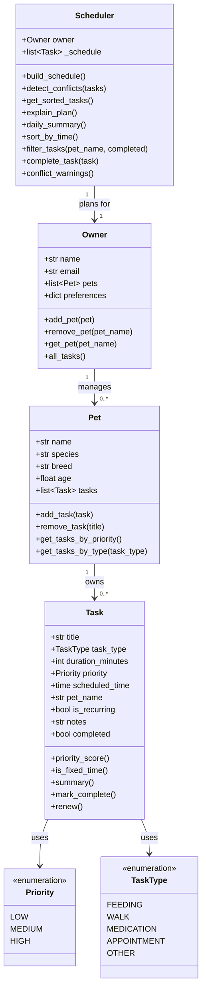

# PawPal+ Project Reflection

## 1. System Design

**a. Initial design**

- Briefly describe your initial UML design.
- What classes did you include, and what responsibilities did you assign to each?

Three core user actions I identified:
1. Add a pet and assign daily care tasks to it.
2. Schedule a day — generate a prioritized, conflict-free plan of tasks.
3. View today's schedule with an explanation of why each task is placed when it is.

Classes and their responsibilities:

| Class | Responsibilities |
|---|---|
| `Task` | Holds all data about a single care action (title, type, duration, priority, optional fixed start time). Knows how to compute its own priority score and produce a one-line summary. |
| `Pet` | Owns a list of Tasks. Provides helpers to filter/sort tasks by priority or type. Stamps each added task with the pet's name. |
| `Owner` | Manages a list of Pets and stores preferences (e.g. preferred walk time). Aggregates all tasks across pets for the scheduler. |
| `Scheduler` | Takes an Owner, collects all tasks, sorts them (fixed-time tasks first, then by priority), detects overlapping time windows, and produces an annotated daily plan with explanations. |

UML diagram (Mermaid.js):

**b. Design changes**

- Did your design change during implementation?
- If yes, describe at least one change and why you made it.

Yes — two notable changes:

1. **`Task` gained a `completed` field and `renew()` method.** The original skeleton had no way to track whether a task was done. Once recurring tasks were added in Phase 4, the need for a clean "mark done and regenerate" pattern became obvious. `renew()` uses `dataclasses.replace()` to produce an immutable copy rather than mutating the original, which made tests much easier to reason about.

2. **`Scheduler` methods filter out completed tasks.** The original `get_sorted_tasks()` returned every task. After `complete_task()` was added, completed tasks started appearing in the schedule alongside their renewals — a confusing duplicate. Adding `if not t.completed` to the sorting/conflict methods fixed this without changing any public API.

---

## 2. Scheduling Logic and Tradeoffs

**a. Constraints and priorities**

- What constraints does your scheduler consider (for example: time, priority, preferences)?
- How did you decide which constraints mattered most?

The scheduler considers two main constraints: **fixed start time** (hard constraint — an appointment at 10:00 cannot move) and **priority** (soft constraint — HIGH tasks are placed before LOW ones among flexible tasks). Fixed-time tasks take precedence because missing a scheduled appointment is worse than delaying a flexible walk. Priority breaks ties among flexible tasks where the owner has no stated preference.

**b. Tradeoffs**

- Describe one tradeoff your scheduler makes.
- Why is that tradeoff reasonable for this scenario?

The conflict detector checks whether two tasks' **time windows overlap** (start + duration), but it does not attempt to reschedule one of the conflicting tasks — it only warns. This means a conflict surfaces as a message rather than an automatic fix. The tradeoff is that the scheduler stays simple and predictable: it never silently moves a task the user explicitly scheduled at a specific time. For a pet care app, surprising an owner by auto-moving a vet appointment could cause real problems, so surfacing a warning and letting the owner decide is the safer choice. The downside is that the schedule can include acknowledged conflicts; a future iteration could offer a "resolve" button that shifts the lower-priority task.

---

## 3. AI Collaboration

**a. How you used AI**

- How did you use AI tools during this project (for example: design brainstorming, debugging, refactoring)?
- What kinds of prompts or questions were most helpful?

AI was used at every phase, but in different modes:

- **Design (Phase 1):** Prompted AI with the four class names and asked for a Mermaid.js class diagram. The diagram gave a visual sanity-check — it immediately surfaced that `Scheduler` needed an explicit reference to `Owner`, not just a list of tasks.
- **Scaffolding (Phase 2):** Used Agent Mode to flesh out all method stubs at once from the UML, saving repetitive boilerplate. The most useful prompt pattern was: *"Based on [file], implement [method] so that it does [specific behavior] — keep docstrings intact."*
- **Algorithmic phase (Phase 4):** Asked AI to suggest lightweight conflict detection strategies and compare two sorting approaches (a manual loop vs. `sorted()` with a lambda key). Seeing both side by side made the tradeoff between readability and brevity concrete.
- **Testing (Phase 5):** Used AI to draft test scaffolding from the method signatures, then manually wrote the edge-case assertions (e.g., `renew()` must not mutate the original) because those required understanding the intent, not just the API shape.

The most effective prompts were specific and constraint-aware: *"return an empty list rather than raising when there are no tasks"* produced code that matched the rest of the design.

**b. Judgment and verification**

- Describe one moment where you did not accept an AI suggestion as-is.
- How did you evaluate or verify what the AI suggested?

When implementing `complete_task()`, the AI's first suggestion called `pet.tasks.remove(task)` to delete the completed original before adding the renewal. I rejected this because `remove()` does an identity/equality check that can silently fail on dataclasses if the object has been modified. More importantly, removing the history meant `filter_tasks(completed=True)` would always return nothing — breaking a feature I'd already designed. I verified by writing `test_complete_task_recurring_original_stays_complete` first (red), then fixing the implementation to keep the original in place (green). The lesson: AI suggested the most obvious mutation, but the test suite revealed the design consequence.

---

## 4. Testing and Verification

**a. What you tested**

- What behaviors did you test?
- Why were these tests important?

The 33-test suite covers four groups:

1. **Task lifecycle** — completion flag, `renew()` copy vs. mutation, priority scores, `is_fixed_time`, `summary` formatting. These are foundational: if `mark_complete` or `renew` behave unexpectedly, every higher-level feature breaks.
2. **Pet management** — `add_task` stamping, count changes, priority sort, `remove_task` found/not-found. Tested because `Pet` is the data owner; corrupt task lists would silently produce wrong schedules.
3. **Scheduler algorithms** — `sort_by_time` chronological order, `filter_tasks` by pet and status, `build_schedule` excluding completed tasks, `detect_conflicts` overlap/same-time/no-overlap, `conflict_warnings` returning strings. These are the core algorithmic claims of the app.
4. **Edge cases** — empty owner, pet with no tasks, non-recurring `complete_task`, `get_pet` returning `None`. Edge cases are important because production code hits these paths constantly (a new user always starts with an empty state).

**b. Confidence**

- How confident are you that your scheduler works correctly?
- What edge cases would you test next if you had more time?

**★★★★☆** — confident in the scheduling logic and data model. The algorithms are simple enough that 33 tests cover the meaningful paths without redundancy.

Edge cases I'd add next:
- Two pets with identically named tasks (does `remove_task` affect the wrong pet?)
- `filter_tasks` with both `pet_name` and `completed` specified together
- A task whose duration exactly fills to midnight (edge of time arithmetic)
- Owner preferences actually influencing sort order (currently stored but not used by the scheduler)

---

## 5. Reflection

**a. What went well**

- What part of this project are you most satisfied with?

The CLI-first workflow. Building and verifying all logic in `main.py` before touching `app.py` meant the Streamlit integration was mechanical — just wiring existing, tested methods to UI components rather than debugging business logic through a browser. The test suite also caught a real bug (completed tasks appearing in the schedule after renewal) that would have been confusing to diagnose through the UI alone.

**b. What you would improve**

- If you had another iteration, what would you improve or redesign?

Two things: First, I'd have `Scheduler` use the owner's `preferences["max_daily_hours"]` to enforce a daily cap — currently the preference is stored but ignored. Second, I'd replace `filter_tasks` returning a plain list with a small `ScheduleView` object that supports chaining (e.g., `scheduler.filter(pet="Mochi").sort_by_time()`), which would make the UI code cleaner and the logic more composable.

**c. Key takeaway**

- What is one important thing you learned about designing systems or working with AI on this project?

AI is fastest at generating the *shape* of code — class skeletons, boilerplate, common patterns — but it cannot know the *intent* behind a design. The moment `complete_task` needed to preserve history for `filter_tasks(completed=True)`, the AI's suggestion (delete and replace) was technically functional but wrong for the design. The architect's job is to hold the full picture: knowing which methods depend on each other, what invariants must hold, and why. AI accelerates the typing; the human provides the coherence.
